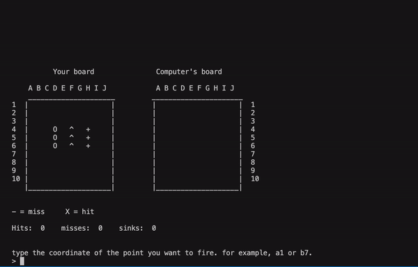

# battleship
Play the board game Battleship against the computer.

# Positioning ships
- position ships using WASD keys and press enter when done

# play against computer
- guess the computer's ship coordinates and the computer will guess yours

# Smart computer moves
- the computer will play very similar to how a human would
- the computer will guess randomly first, and if it gets a hit, then it will guess around that coordinate

# incorrect input identification
- if the user enters a wrong coordinate, or repeats it, then the program will catch it so that there are no errors.

# what is to be done:
- making ships able to turn
- better guessing algorithm for computer (not just random)
- make multiple levels
- fix bug of allowing to enter the coordinate multiple times if it is a hit
